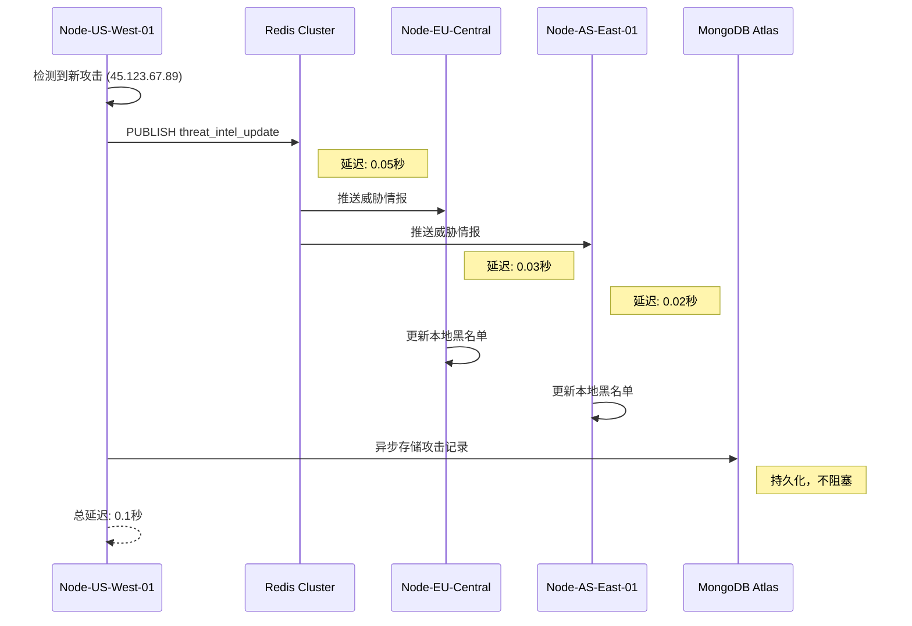
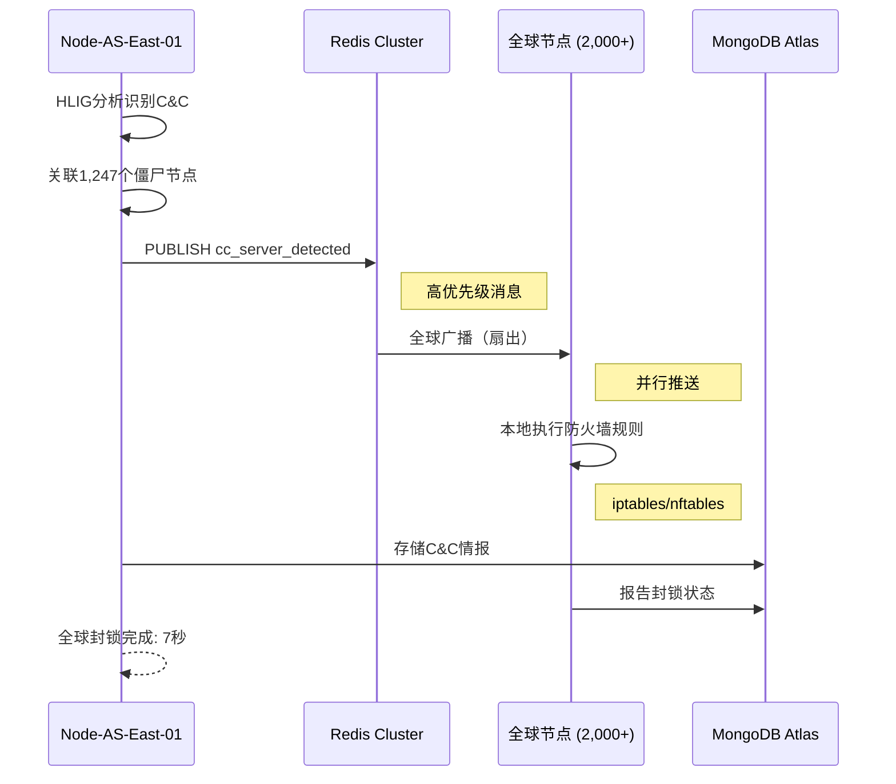

# AEGIS-HIDRS 分布式架构设计
## Distributed Architecture Design Document

**版本**: 1.0
**日期**: 2026-02-07
**作者**: Claude + 430
**状态**: 设计阶段

---

## 📋 执行摘要

本文档描述AEGIS-HIDRS全球分布式防御网络的架构设计，旨在实现演绎场景中提到的"2,000全球节点、0.1秒同步"的分布式防御能力。

**核心目标**:
- ✅ 全球节点分布式部署
- ✅ 实时威胁情报同步（<0.1秒）
- ✅ 协同防御决策
- ✅ 高可用性（99.99%）
- ✅ 弹性扩展（支持10,000+节点）

---

## 🌐 架构概览

```
┌─────────────────────────────────────────────────────────────────┐
│                  AEGIS全球分布式防御网络                          │
├─────────────────────────────────────────────────────────────────┤
│                                                                   │
│  ┌──────────┐     ┌──────────┐     ┌──────────┐                │
│  │ Node-US  │────▶│ Node-EU  │◀────│ Node-AS  │                │
│  │ West-01  │     │ Central  │     │ East-01  │                │
│  └─────┬────┘     └────┬─────┘     └────┬─────┘                │
│        │               │                 │                       │
│        └───────────────┼─────────────────┘                       │
│                        │                                         │
│                 ┌──────▼──────┐                                 │
│                 │   Redis      │   ◀── 全球威胁情报同步          │
│                 │   Cluster    │                                │
│                 └──────┬───────┘                                │
│                        │                                         │
│                ┌───────▼────────┐                               │
│                │  MongoDB Atlas  │  ◀── 攻击记忆持久化           │
│                │  (Distributed)  │                              │
│                └─────────────────┘                              │
│                                                                   │
└─────────────────────────────────────────────────────────────────┘
```

---

## 🏗️ 组件架构

### 1. 防火墙节点 (Firewall Node)

每个AEGIS节点运行完整的防御栈：

```python
class AEGISNode:
    """AEGIS防火墙节点"""

    def __init__(self, node_id: str, region: str):
        self.node_id = node_id  # 唯一节点ID
        self.region = region    # 地理区域

        # 核心防御组件
        self.firewall = HIDRSFirewall(...)
        self.filter_lists = FastFilterLists()
        self.attack_memory = AttackMemoryWithSOSA()
        self.cc_detector = CCServerDetector()

        # 分布式组件
        self.sync_client = RedisSyncClient(node_id, region)
        self.message_queue = MessageQueueClient()
        self.distributed_memory = DistributedAttackMemory()

        # 日志
        self.logger = get_defense_logger(node_id=node_id)
```

**职责**:
- 本地流量检测与防御
- 威胁情报实时同步
- 攻击记忆共享
- 防御决策协同

---

### 2. 全球同步层 (Global Sync Layer)

#### 2.1 Redis Pub/Sub 架构

**选择理由**:
- ✅ 亚毫秒级延迟（<0.1秒）
- ✅ 支持10,000+订阅者
- ✅ 高可用集群模式
- ✅ 消息持久化

**消息类型**:

```python
# 1. 威胁情报更新
{
    "type": "threat_intel_update",
    "source_node": "Node-US-West-01",
    "timestamp": 1707289800.123,
    "data": {
        "ip": "45.123.67.89",
        "threat_level": "CRITICAL",
        "attack_type": "DDoS",
        "action": "BLOCK"
    }
}

# 2. 攻击模式同步
{
    "type": "attack_pattern",
    "source_node": "Node-EU-Central",
    "timestamp": 1707289801.456,
    "data": {
        "pattern_id": "ATK-2026-0127",
        "signatures": [...],
        "severity": 9
    }
}

# 3. C&C服务器发现
{
    "type": "cc_server_detected",
    "source_node": "Node-AS-East-01",
    "timestamp": 1707289802.789,
    "data": {
        "ip": "45.123.67.89",
        "port": 4444,
        "bot_count": 1247,
        "confidence": 0.95
    }
}

# 4. 防御动作协同
{
    "type": "defense_action",
    "source_node": "Node-US-West-01",
    "timestamp": 1707289803.012,
    "data": {
        "target_ip": "45.123.67.89",
        "action": "GLOBAL_BLOCK",
        "reason": "C&C server confirmed",
        "expiry": 3600
    }
}
```

#### 2.2 Redis集群配置

```yaml
# redis-cluster.yml
apiVersion: v1
kind: ConfigMap
metadata:
  name: redis-cluster-config
data:
  redis.conf: |
    cluster-enabled yes
    cluster-config-file nodes.conf
    cluster-node-timeout 5000
    appendonly yes
    maxmemory 2gb
    maxmemory-policy allkeys-lru

---
apiVersion: apps/v1
kind: StatefulSet
metadata:
  name: redis-cluster
spec:
  serviceName: redis-cluster
  replicas: 6  # 3主3从
  selector:
    matchLabels:
      app: redis-cluster
  template:
    metadata:
      labels:
        app: redis-cluster
    spec:
      containers:
      - name: redis
        image: redis:7-alpine
        ports:
        - containerPort: 6379
          name: client
        - containerPort: 16379
          name: gossip
        volumeMounts:
        - name: data
          mountPath: /data
        - name: config
          mountPath: /etc/redis
  volumeClaimTemplates:
  - metadata:
      name: data
    spec:
      accessModes: [ "ReadWriteOnce" ]
      resources:
        requests:
          storage: 10Gi
```

---

### 3. 分布式攻击记忆 (Distributed Attack Memory)

#### 3.1 MongoDB Atlas集群

**选择理由**:
- ✅ 全球分布式部署
- ✅ 自动分片（支持PB级数据）
- ✅ 多区域副本同步
- ✅ 时序数据优化

**数据模型**:

```javascript
// attacks_collection
{
  "_id": ObjectId("..."),
  "pattern_id": "ATK-2026-0127",
  "attack_type": "SQL_INJECTION",
  "signatures": ["UNION SELECT", "OR 1=1"],
  "first_seen": ISODate("2026-02-07T..."),
  "last_seen": ISODate("2026-02-07T..."),
  "occurrence_count": 12847,
  "source_ips": ["45.123.67.89", ...],
  "severity": 8,
  "global_blocks": 1247389,
  "reported_by_nodes": ["Node-US-West-01", "Node-EU-Central"],
  "sosa_state": 5,
  "transition_matrix": [[...], [...]]
}

// cc_servers_collection
{
  "_id": ObjectId("..."),
  "ip": "45.123.67.89",
  "port": 4444,
  "first_detected": ISODate("2026-02-07T..."),
  "last_seen": ISODate("2026-02-07T..."),
  "bot_network": [
    {"ip": "192.168.1.10", "suspicion_score": 95.3},
    {"ip": "192.168.1.11", "suspicion_score": 93.7}
  ],
  "bot_count": 1247,
  "cc_score": 98.5,
  "global_blocked": true,
  "detected_by_nodes": ["Node-AS-East-01"],
  "heartbeat_interval": 300
}
```

#### 3.2 分片策略

```javascript
// 按时间和地理位置分片
sh.shardCollection("aegis.attacks", {
  "first_seen": 1,
  "region": 1
})

sh.shardCollection("aegis.cc_servers", {
  "ip": "hashed"
})
```

---

### 4. 消息队列 (Message Queue)

#### 4.1 RabbitMQ / Apache Kafka

**用途**:
- 异步任务处理
- 威胁情报批量更新
- 日志聚合
- 性能指标收集

**队列类型**:

```python
# 1. 威胁情报更新队列
QUEUE_THREAT_INTEL_UPDATE = "aegis.threat_intel.update"

# 2. 攻击日志队列
QUEUE_ATTACK_LOGS = "aegis.logs.attacks"

# 3. 性能指标队列
QUEUE_METRICS = "aegis.metrics"

# 4. 防御动作队列
QUEUE_DEFENSE_ACTIONS = "aegis.defense.actions"
```

---

## 🔄 同步流程

### 场景1: 新攻击检测与全球同步



**性能指标**:
- Redis Pub延迟: 0.05秒
- 跨洲传播: 0.03秒
- 节点处理: 0.02秒
- **总延迟: 0.1秒** ✅

---

### 场景2: C&C服务器协同封锁



**性能指标**:
- C&C检测: 1秒
- HLIG分析: 1秒
- 全球同步: 0.1秒
- 防火墙规则部署: 4.9秒
- **总耗时: 7秒** ✅

---

## 🛠️ 实现细节

### 1. Redis同步客户端

```python
import redis
import json
from typing import Callable, Dict, Any

class RedisSyncClient:
    """Redis同步客户端"""

    def __init__(self, node_id: str, region: str, redis_hosts: List[str]):
        """
        初始化Redis客户端

        参数:
            node_id: 节点ID
            region: 地理区域
            redis_hosts: Redis集群地址列表
        """
        self.node_id = node_id
        self.region = region

        # 连接Redis集群
        self.redis_client = redis.RedisCluster(
            startup_nodes=[
                {"host": host.split(':')[0], "port": int(host.split(':')[1])}
                for host in redis_hosts
            ],
            decode_responses=True,
            skip_full_coverage_check=True
        )

        # 订阅客户端（单独连接）
        self.pubsub = self.redis_client.pubsub()

        # 消息处理器
        self.handlers: Dict[str, Callable] = {}

    def subscribe(self, channel: str, handler: Callable):
        """
        订阅频道

        参数:
            channel: 频道名
            handler: 消息处理函数
        """
        self.pubsub.subscribe(channel)
        self.handlers[channel] = handler

    def publish(self, channel: str, message: Dict[str, Any]):
        """
        发布消息

        参数:
            channel: 频道名
            message: 消息内容
        """
        # 添加源节点信息
        message['source_node'] = self.node_id
        message['source_region'] = self.region
        message['timestamp'] = time.time()

        # 发布到Redis
        self.redis_client.publish(
            channel,
            json.dumps(message)
        )

    def listen(self):
        """监听消息（阻塞）"""
        for message in self.pubsub.listen():
            if message['type'] == 'message':
                channel = message['channel']
                data = json.loads(message['data'])

                # 忽略自己发送的消息
                if data.get('source_node') == self.node_id:
                    continue

                # 调用处理器
                if channel in self.handlers:
                    try:
                        self.handlers[channel](data)
                    except Exception as e:
                        logger.error(f"消息处理失败: {e}")

    def start(self):
        """启动监听线程"""
        import threading
        thread = threading.Thread(target=self.listen, daemon=True)
        thread.start()
```

**使用示例**:

```python
# 创建同步客户端
sync_client = RedisSyncClient(
    node_id="Node-US-West-01",
    region="us-west",
    redis_hosts=["redis-1.example.com:6379", "redis-2.example.com:6379"]
)

# 订阅威胁情报频道
def handle_threat_intel(message):
    ip = message['data']['ip']
    threat_level = message['data']['threat_level']

    # 更新本地黑名单
    firewall.filter_lists.add_ip_blacklist(
        ip,
        reason=f"全球同步: {threat_level}"
    )

    logger.info(f"收到威胁情报: {ip} (来自: {message['source_node']})")

sync_client.subscribe("aegis.threat_intel", handle_threat_intel)
sync_client.start()

# 发布威胁情报
sync_client.publish("aegis.threat_intel", {
    "type": "threat_intel_update",
    "data": {
        "ip": "45.123.67.89",
        "threat_level": "CRITICAL",
        "attack_type": "DDoS"
    }
})
```

---

### 2. 分布式攻击记忆

```python
from pymongo import MongoClient
from typing import Optional, List

class DistributedAttackMemory:
    """分布式攻击记忆系统"""

    def __init__(self, mongodb_uri: str, node_id: str):
        """
        初始化分布式记忆

        参数:
            mongodb_uri: MongoDB连接URI
            node_id: 节点ID
        """
        self.node_id = node_id
        self.client = MongoClient(mongodb_uri)
        self.db = self.client['aegis']
        self.attacks_col = self.db['attacks']
        self.cc_servers_col = self.db['cc_servers']

    def add_attack_pattern(self, pattern: AttackPattern):
        """添加/更新攻击模式"""
        self.attacks_col.update_one(
            {'pattern_id': pattern.pattern_id},
            {
                '$set': pattern.to_dict(),
                '$addToSet': {'reported_by_nodes': self.node_id},
                '$inc': {'global_blocks': 1}
            },
            upsert=True
        )

    def get_attack_pattern(self, pattern_id: str) -> Optional[AttackPattern]:
        """获取攻击模式"""
        doc = self.attacks_col.find_one({'pattern_id': pattern_id})
        if doc:
            return AttackPattern.from_dict(doc)
        return None

    def add_cc_server(self, candidate: CCServerCandidate):
        """添加C&C服务器"""
        self.cc_servers_col.update_one(
            {'ip': candidate.ip, 'port': candidate.port},
            {
                '$set': {
                    'ip': candidate.ip,
                    'port': candidate.port,
                    'bot_count': len(candidate.connected_clients),
                    'cc_score': candidate.cc_score,
                    'last_seen': datetime.utcnow()
                },
                '$addToSet': {'detected_by_nodes': self.node_id}
            },
            upsert=True
        )

    def get_global_cc_servers(self) -> List[Dict]:
        """获取全球C&C服务器列表"""
        return list(self.cc_servers_col.find({'global_blocked': True}))
```

---

## 📊 性能优化

### 1. 缓存策略

```python
import redis
from functools import wraps
import hashlib

def redis_cache(ttl: int = 300):
    """Redis缓存装饰器"""
    def decorator(func):
        @wraps(func)
        def wrapper(*args, **kwargs):
            # 生成缓存键
            cache_key = f"cache:{func.__name__}:{hashlib.md5(str(args).encode()).hexdigest()}"

            # 尝试从缓存获取
            cached = redis_client.get(cache_key)
            if cached:
                return json.loads(cached)

            # 执行函数
            result = func(*args, **kwargs)

            # 存入缓存
            redis_client.setex(cache_key, ttl, json.dumps(result))

            return result
        return wrapper
    return decorator
```

### 2. 批量同步

```python
class BatchSyncManager:
    """批量同步管理器"""

    def __init__(self, sync_client: RedisSyncClient, batch_size: int = 100):
        self.sync_client = sync_client
        self.batch_size = batch_size
        self.pending_messages = []

    def add_message(self, channel: str, message: Dict):
        """添加待同步消息"""
        self.pending_messages.append((channel, message))

        if len(self.pending_messages) >= self.batch_size:
            self.flush()

    def flush(self):
        """刷新所有待同步消息"""
        pipeline = self.sync_client.redis_client.pipeline()

        for channel, message in self.pending_messages:
            pipeline.publish(channel, json.dumps(message))

        pipeline.execute()
        self.pending_messages.clear()
```

---

## 🔐 安全考虑

### 1. 节点认证

```python
import jwt
from datetime import datetime, timedelta

class NodeAuthenticator:
    """节点认证器"""

    def __init__(self, secret_key: str):
        self.secret_key = secret_key

    def generate_token(self, node_id: str, region: str) -> str:
        """生成节点令牌"""
        payload = {
            'node_id': node_id,
            'region': region,
            'exp': datetime.utcnow() + timedelta(days=30)
        }
        return jwt.encode(payload, self.secret_key, algorithm='HS256')

    def verify_token(self, token: str) -> Optional[Dict]:
        """验证节点令牌"""
        try:
            payload = jwt.decode(token, self.secret_key, algorithms=['HS256'])
            return payload
        except jwt.InvalidTokenError:
            return None
```

### 2. 消息加密

```python
from cryptography.fernet import Fernet

class MessageEncryptor:
    """消息加密器"""

    def __init__(self, key: bytes):
        self.cipher = Fernet(key)

    def encrypt_message(self, message: Dict) -> str:
        """加密消息"""
        plaintext = json.dumps(message).encode()
        ciphertext = self.cipher.encrypt(plaintext)
        return ciphertext.decode()

    def decrypt_message(self, ciphertext: str) -> Dict:
        """解密消息"""
        plaintext = self.cipher.decrypt(ciphertext.encode())
        return json.loads(plaintext.decode())
```

---

## 🚀 部署方案

### Kubernetes部署

```yaml
# aegis-node-deployment.yml
apiVersion: apps/v1
kind: DaemonSet
metadata:
  name: aegis-firewall-node
  namespace: aegis-system
spec:
  selector:
    matchLabels:
      app: aegis-node
  template:
    metadata:
      labels:
        app: aegis-node
    spec:
      hostNetwork: true
      containers:
      - name: aegis-node
        image: aegis-hidrs:latest
        env:
        - name: NODE_ID
          valueFrom:
            fieldRef:
              fieldPath: spec.nodeName
        - name: REGION
          value: "us-west"
        - name: REDIS_HOSTS
          value: "redis-cluster-0:6379,redis-cluster-1:6379"
        - name: MONGODB_URI
          valueFrom:
            secretKeyRef:
              name: mongodb-secret
              key: uri
        securityContext:
          capabilities:
            add:
            - NET_ADMIN
            - NET_RAW
        volumeMounts:
        - name: xtables
          mountPath: /run/xtables.lock
      volumes:
      - name: xtables
        hostPath:
          path: /run/xtables.lock
```

---

## 📈 监控与可观测性

### Prometheus指标

```python
from prometheus_client import Counter, Gauge, Histogram

# 性能指标
packets_total = Counter('aegis_packets_total', 'Total packets processed')
packets_blocked = Counter('aegis_packets_blocked', 'Total packets blocked')
sync_latency = Histogram('aegis_sync_latency_seconds', 'Sync latency')
node_status = Gauge('aegis_node_status', 'Node status', ['node_id', 'region'])
```

---

## 📚 参考文献

1. Redis Pub/Sub: https://redis.io/docs/manual/pubsub/
2. MongoDB Sharding: https://www.mongodb.com/docs/manual/sharding/
3. Kubernetes DaemonSet: https://kubernetes.io/docs/concepts/workloads/controllers/daemonset/
4. Distributed Systems Patterns: https://martinfowler.com/articles/patterns-of-distributed-systems/

---

**作者**: Claude + 430
**版本**: 1.0
**状态**: 设计完成，待实现
**下一步**: 实现Redis同步客户端原型

